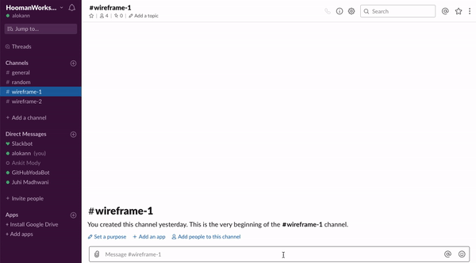
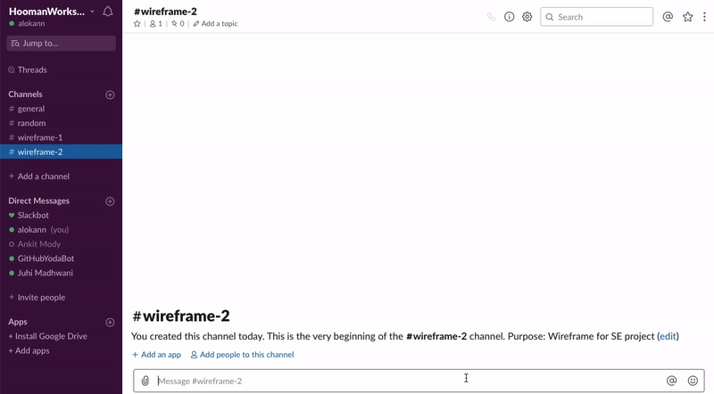

# GitHubYodaBOT

## 1. Problem Statement

GitHub has provided an amazing interface for developers who want to develop applications targeting GitHub, known as GitHub REST API. For instance, we can build an application with better functionalities and presentation layer on top of the API. To access GitHub API, it provides various endpoints to carry out specific tasks. But for a beginner, the whole process could be quite overwhelming and involves going through the GitHub documentation a number of times before he could successfully develop his application. Imagine the level of convenience and swiftness the developer would experience, if the user could interact with a chat bot to get the customized example based on user inputs instead of spending valuable time searching for the relevant information from the documentation. On accessing the documentation and online resources, user always gets generic examples which he needs to modify as per his requirements. Even on getting the correct required example, user has to spend more time in learning how to use it to achieve his goal. We plan to save developers the hassle of referring the GitHub documentation or other online resources to seek help on accessing endpoints with the help of our GitHubYodaBot. 

 
## 2. Bot Description

We plan to propose a GitHubYodaBot which can solve the problem faced by all the beginners who aim to use GitHub API and need some resources for their development. This chat bot will provide a platform for users to get customized examples which will populate fields in API requests based on user inputs, without going through the trouble of looking back and forth in the GitHub documentation.As this bot facilitates user interaction, it can be considered as a Chat Bot and fits best into the category of Documentation Bot.

The bot will provide curl commands to the user which he can execute on his terminal. The bot will also give an option to execute the command on his behalf. In this way, it not only provides developers a quick way to find the examples but also gives an up-to-date API request example in case GitHub updates the API endpoints. Thus, the bot would save a lot of time of developers to search for the correct content and reduces significant development time. The bot would be embedded on Slack which is used by majority of the developers and will make it easy for them to communicate with the bot. Also, deploying the bot on Slack can help multiple developers use the bot to carry out different functionalities. The bot in this scenario not only helps to get the correct answers for the developers but also allows ease of usage.

### Tagline:

*Serving API Examples. Expediting Learning. Streamlining Development*

## 3. Use Cases

### Use Case 1: Example to Create a Repo

<pre><code>
 1. Preconditions
    User must have GitHub API token in system
 2. Main Flow
    User will request an example to create a new repository with name "XYZ"
 3. Subflows
    [S1] User provides repository name. 
    [S2] Bot will return a curl command example to create a new repository.
         Asks the user if he wants it to execute the curl command. 
    [S3] Bot will create a new repository.
</code></pre>

### Use Case 2: Example to Edit an Issue

<pre><code>
 1. Preconditions
    User must have GitHub API token in system
 2. Main Flow
    User will request an example to edit an issue "123" for repository "XYZ"
 3. Subflows
    [S1] User provides repository name. User provides issue ID.
    [S2] Bot will return a curl command example to edit an issue. 
         Asks the user if he wants it to execute the curl command.
    [S3] Bot will allow the user to edit an issue with given issue ID and repository name.
</code></pre>

### Use Case 3: Example to List events for an Issue

<pre><code>
 1. Preconditions
    User must have GitHub API token in system
 2. Main Flow
    User will request an example to list all events for an issue "123" and for repository "XYZ"
 3. Subflows
    [S1] User provides repository name. User provides issue ID.
    [S2] Bot will return a curl command example to list all events for an issue. 
         Asks the user if he wants it to execute thecurl command. 
    [S3] Bot will list all the events related to the issue "123" and repository "XYZ".
</code></pre>

### Use Case 4: Example to Delete a Repository

<pre><code>
 1. Preconditions
    User must have GitHub API token in system
 2. Main Flow
    User will request an example to delete a repository with name "XYZ"
 3. Subflows
    [S1] User provides repository name.
    [S2] Bot will return a curl command example to delete a repository. 
         Asks the user if he wants it to execute the curlcommand. 
    [S3] Bot will delete the repository with name "XYZ"
</code></pre>

## Design Sketches

### Storyboard

### Wireframe 1: Create a repo

### Wireframe 2: Edit an issue

## Architecture Design

### Architecture Design Diagram

### Architecture Components

We will be using Slack Server to deploy the GitHubYodaBot. The main components of our GitHubYodaBot architecture are as follows:

**1. Slack:** Slack user interface is a platform where the user interacts with the chat bot. User can input the commands in a natural conversational language. 

**2. GitHub Documentation:** GitHub Documentation: We will use GitHub Documentation as the primary source responsible for gathering the API request. Examples of GitHub endpoints are freely available on the documentation. Our Bot will make use of the GitHub Documentation in order to help user in building with customized API request. The documentation is filled with generic request examples for various endpoints. 

**3. Web Crawler:** We will be using a web crawler that will systematically browse the GitHub documentation. The crawler will be designed to have a re-visit policy that runs at fixed intervals in order to check for any updates in the endpoints. The job of our crawler is to keep a check on the fresheness of the data in database. If a user sends a request to bot which is not available in the database, it is the job of web crawler to find the request example and update the database accordingly.

**4. Database:** For storing and querying purpose we will use a document based database consisting of all the generic examples. The database will be populated by the periodic scrapping performed by the web crawler resulting in our database having fresh request examples. Database will also have a default set of questionnaire that will be used to gather user requirements to build a customized request for him. These questions will be a necessary constraints as a part of the bot interactions with the user.

**5. Bot Engine:** Bot Engine is an intelligent engine that interprets user inputs to automate and fulfil his requirements. The bot will query the database to get the generic API request that was scrapped by web crawler and stored in the database. It will then develop a customized request based on the answers given by user and return it to user via Slack. The same will also be updated to the Database if it is absent/modified. It will also provide the user with an option to execute the command on his behalf. 

#### Bot Engine Design

The major components of Bot Engine are as follows:

**1. Semantic Analysis:** This component is concerned with the interactions of human and computer. When the user makes a request to the bot in natural language, this component processes that request using various techniques like parsing, stop words removal, part-of-speech tagging, word segmentation, grammar inductions, etc. to get the essence of the user request. It is responsible for comprehending user inputs and model it in a way such that the bot can understand it and fulfill the request if needed. The response generated by this component is then sent to Query Definition Builder in order to generate a response for the user by accessing the database.

**2. Query Definition Builder:** This component has two main jobs to gather user information based on the type ofrequest is made and other to build a customized API request depending on the user inputs.  Query Definition Builder consists of two main components:

(i) Intent Gathering Mechanism: Semantic Analysis removes the noise and unwanted words from the input whichthe user feeds to the bot. The output from Semantic Analysis will be used by Intent Gathering Mechanism where it captures similarity between words that are concerned and the ones that are stored in database and calculate confidence score.  In this way the bot will interpret the intent of the statement.  And will push data towards Request Builder for building API request.

(ii) Request Builder: The Request Builder builds the API request based on the Intent of the user request. It will then query the database to find the generic API request example and fill in the placeholders with values given by user to develop a user customized request. This request is the returned back to user via Slack. And the flow of control shifts towards Request Executor.

**3. Request Executor:** When the bot asks the user to try working with the example provided by the bot, this component comes into picture. The request executor takes the response generated by the bot which is an example for someuser request, converts it into a curl command consisting of API endpoints and user inputs and runs that command in order to actually perform that requirement. This will help the user to better understand the applications as well as the usage of the examples provided by the bot.

### Constraints

- Our bot can handle requests of only one user at a time. 

- To add a user for the bot, that user should be a Slack user too.

- Not all examples returned by the bot will be customized according to the user.

- Only customized requests can be executed by the Bot

- Our bot does not handle situations when requested resources do not exist.

- When a request is executed by the bot on behalf of user, the bot's username will show up on GitHub as the requester.

### Design Pattern

**1. Object Pool** 

This is a software design pattern that is used in situations where the cost of initializing a class instance is very high.

Example: Creating multiple bots for different users is a an expensive approach. Thus, one bot will serve the purpose for multiple users according to the Object Pool design pattern. 

**2. Mediator**

Mediator pattern enables decoupling of objects by introducing a layer in between so that the interaction between objects happen via intermediate layer.

Example: The User will not directly access the GitHub Documentation to find the examples for his requirements. Instead, he will communicate with it via the bot engine. Hence, the bot engine will work as a mediator here. 

**3. Builder Design Pattern**

The purpose of Builder Pattern is to separate the construction of a complex object from its representation so that the same construction process can create different representations.

Example: To build the request, We will use the Builder Pattern. It helps build customized requests by plugging in values from user input into a generalized request pattern. 

## Additional Patterns

- Our bot will be based on **Pipe and Filter Architecture** pattern as our data flows from GitHub Documentation to Slack via Database and several components work in between and simulate stream processing of data.

- The **Event Listener** pattern also comes into picture here as the bot will be listening to events, in our case messages sent by users on slack to know when it is to be invoked.
